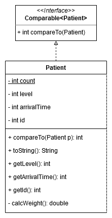

## Patient Class ##


The Patient class implements the Java Comparable interface. This allows Patient object to easily be inserted and removed from a Java PriorityQueue according to a calculated weight.

At this point, the bulk of this class involves assigning a random urgency level to each new object, and comparing internal calculated weights as required by the Comparable interface.

Priority weight currently uses the following calculation:
```
weight = (0.6 * level / 4) + (0.4 * 1 / arrivalTime)
```
This ensures that the max weight is 1. A large level and an earlier (smaller) arrival time will ensure a large weight.

This calculation *will* need to be tweaked after testing to get the desired priority behavior.

Importantly, if a Patient's urgency level is 4, a value of 100 is used for `level`. This hack guarantees that level 4 Patients will always get immediate priority

It will be up to the main runner class to assign an appropriate arrival time.

#### Constructor ####
The Patient constructor has the heading
```java
public Patient(int currentTime)
```
The constructor uses `Math.random()` to assign an urgency level to the object from 1-4, according to the following distribution

1. – 15% minor treatment needed
2. – 30% common treatment needed
3. – 45% serious treatment needed
4. – 10% life or death treatment needed

#### Other methods ####
The Patient.toString() class returns a string of the form
`Patient{id=#, level=#, time=#, weight=.#}` for debugging purposes.