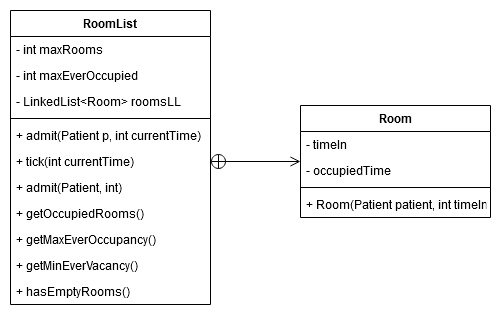

## RoomList Class ##

A wrapper class for a LinkedList of Room objects.

The `admit()` method will ensure that no more than `maxRooms` elements can be added to the `private LinkedList`

The public method `tick(int currentTime)` is intended to be called once per simulation step. This removes any Room nodes from the linked list that have existed from longer then their designated time. In this way, more rooms become available.

The class also keeps track of the maximum ever size of the list.

`hasEmptyRooms()` can be used to check if a new patient can be admitted.
